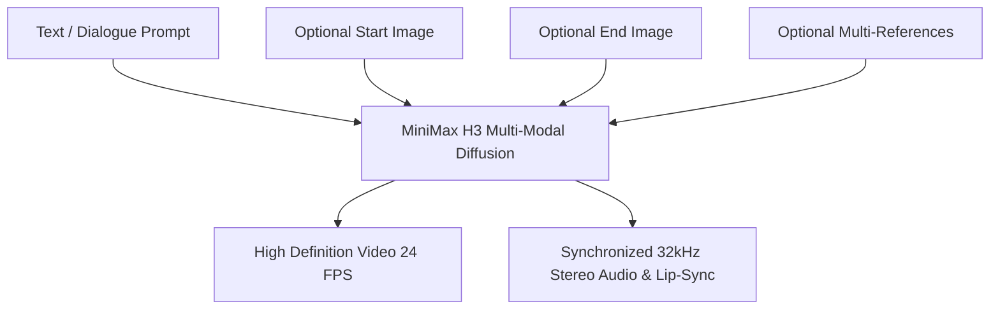

# MiniMax H3 Local Video Agent & Wan2GP Generative Studio 🎬⚡

[](LICENSE)
[](https://www.python.org/)
[](https://pytorch.org/)
[](https://nvidia.com)
[](https://github.com/deepbeepmeep/Wan2GP)

A universal, high-performance local AI generative studio for running **MiniMax H3** and the entire **Wan2GP (WanGP)** generative ecosystem across all NVIDIA GPU tiers (from 8GB/12GB consumer cards like the RTX 3060/4070 up to 16GB/24GB/32GB/48GB+ cards like the RTX 4080/5080/4090/5090, RTX 6000 Ada, A100, and H100).

Generate everything from **synchronized 720p/1080p cinematic videos with native 32kHz stereo audio and character lip-sync** in 2–4 minutes, to **5-minute complete songs with lyrics**, **character motion transfers**, **interactive video inpainting**, and **4K infographics**.

---

## 📋 Table of Contents
1. [🚀 1-Click Quickstart (Windows & Linux)](#-1-click-quickstart)
2. [🖥️ Universal Hardware & VRAM Guide (8GB to 80GB+)](#️-universal-hardware--vram-guide)
3. [🧠 MiniMax H3 Deep-Dive: Architectures & Use Cases](#-minimax-h3-deep-dive)
4. [⚙️ Comprehensive Settings, Modes & What They Do](#️-comprehensive-settings--modes-guide)
   - [Quantization & Text Encoders](#1-quantization--text-encoders)
   - [Acceleration & Step Skipping (Turbo LoRA, First Block Cache, SageAttn)](#2-acceleration--step-skipping)
   - [Generation Phases & Latent Upscaling (1-Phase, 2-Phase, Tiling)](#3-generation-phases--latent-upscaling)
   - [Longer Videos, Overlap Frames & Storyboarding](#4-longer-videos-sliding-windows--storyboarding)
   - [Audio Conditioning & Lip-Sync Dialogue Syntax](#5-audio-conditioning--lip-sync-dialogue-syntax)
5. [🎨 The Full Wan2GP Studio: What Models Are Included](#-the-full-wan2gp-studio)
6. [🧰 Built-In Tools & Post-Processing Suite](#-built-in-tools--post-processing-suite)
7. [⚠️ Known Limitations, Constraints & Trade-Offs](#️-known-limitations--trade-offs)
8. [📦 Model Catalog & Download Options](#-model-catalog--download-options)
9. [🛠️ Troubleshooting & Memory FAQs](#️-troubleshooting--memory-faqs)
10. [🙏 Credits & License](#-credits--license)

---

## 🚀 1-Click Quickstart

### Windows (1-Click)
1. **Clone this repository:**
   ```cmd
   git clone https://github.com/PatelVrund-GameDev/minimax-h3-local-runner.git
   cd minimax-h3-local-runner
   ```
2. **Run the Installer:** Double-click **`setup_windows.bat`** *(Creates Python 3.11 `.venv`, installs PyTorch with CUDA, Triton Windows, SageAttention 2.2.0, and dependencies)*.
3. **Download Models:** Double-click **`download_models.bat`** *(Select your hardware tier to automatically fetch checkpoints with resume support)*.
4. **Start the Web UI:** Double-click **`run_windows.bat`** and open `http://127.0.0.1:7860` in your browser.

---

### Linux / WSL (1-Click)
```bash
git clone https://github.com/PatelVrund-GameDev/minimax-h3-local-runner.git
cd minimax-h3-local-runner
chmod +x *.sh

./setup_linux.sh          # 1. Automatic installation
./download_models.sh      # 2. Interactive model downloader
./run_linux.sh            # 3. Launch Gradio Web UI
```

---

## 📂 Checkpoints & Expected File Locations

If you use `download_models.bat` (or manually place files), here is the exact folder structure and expected file paths on disk:

```text
local-video-agent/
 └── wan2gp_core/
      ├── ckpts/
      │    ├── MiniMax-H3-FL2VA-pruned_rank8_int8_convrot.safetensors   <-- Main Model (Pruned 20B INT8)
      │    ├── MiniMax-H3-FL2VA_int8_convrot.safetensors               <-- Main Model (Full 33B INT8)
      │    ├── MiniMax-H3-video_vae_fp16.safetensors                   <-- Video VAE
      │    ├── MiniMax-H3-audio_vae_fp32.safetensors                   <-- Audio VAE
      │    ├── minimax_h3/
      │    │    └── minimax_h3_latent_upscaler_3d_bf16.safetensors     <-- 3D Latent Upscaler
      │    └── Qwen3-VL-32B-Instruct/
      │         ├── Qwen3-VL-32B-Instruct-layer50_quanto_bf16_int8.safetensors <-- Text Encoder (Quanto INT8)
      │         ├── config.json
      │         ├── tokenizer.json
      │         ├── tokenizer_config.json
      │         ├── preprocessor_config.json
      │         └── vocab.json
      └── loras/
           └── minimax_h3/
                ├── minimax_h3_lightx2v_fl2v_turbo_4step_alpha128_v1.0_768p_bf16.safetensors <-- 4-Step Turbo LoRA
                └── minimax_h3_lightx2v_fl2v_turbo_8step_alpha8_v1.0_bf16.safetensors        <-- 8-Step Turbo LoRA
```

### 🔍 Understanding the Web UI "URLs" Tab:
Inside the Web UI under the **URLs** tab:
* **Main Checkpoints**: Displays the supported Hugging Face URLs for the selected model. When generating, Wan2GP automatically matches these filenames to your local files inside `wan2gp_core/ckpts/` and loads them directly from disk.
* **Text Encoder Checkpoints**: Left **blank by default**. Leaving this empty tells Wan2GP to load the official built-in text encoder (`wan2gp_core/ckpts/Qwen3-VL-32B-Instruct/Qwen3-VL-32B-Instruct-layer50_quanto_bf16_int8.safetensors`). You can also manually paste custom paths or browse via the yellow folder icon.
* **Video & Audio VAE File**: Left **blank by default** to use `MiniMax-H3-video_vae_fp16.safetensors` and `MiniMax-H3-audio_vae_fp32.safetensors`.

---

## 🖥️ Universal Hardware & VRAM Guide

MiniMax H3 and Wan2GP are built to scale dynamically from budget laptops to massive server clusters:

| Hardware Tier | Typical GPUs | VRAM | Recommended Model & Text Encoder | Max Target Resolution | Workflow & Expected Speed |
|---|---|---|---|---|---|
| **Tier 1: Entry / Budget** | RTX 3060 (12G), RTX 4060 Ti (16G), RTX 2080 Ti (11G) | **8 – 12 GB** | **FL2VA Pruned 20B (INT8)** + GGUF Q4 Text Enc + FP8 VAE | **480p – 720p** | Turbo LoRA (4–6 steps) + Two-Phase Tiling (~1–3 min) |
| **Tier 2: Mid / High Consumer** | RTX 3080, 4070, 4070 Ti, 4080, **RTX 5080** | **12 – 16 GB** | **FL2VA Pruned 20B (INT8)** + Quanto INT8 Text Enc | **720p Native / 1080p 2-Phase** | Turbo LoRA (6–8 steps) + First Block Cache (0.08) (~2–4 min) |
| **Tier 3: Top Enthusiast** | RTX 3090, 4090, **RTX 5090** | **24 – 32 GB** | **FL2VA 33B (INT8 or BF16)** / Pruned 20B | **1080p Native** | Single-Phase direct 1080p, 8–12 steps Turbo or 20 steps standard (~1.5–3 min) |
| **Tier 4: Enterprise Workstation** | RTX 6000 Ada, A100 (80G), H100, B200 | **48 – 80 GB+** | **FL2VA 33B Full BF16** + Full BF16 Text Enc | **1080p / 4K** | Full unpruned precision, Ralston 2S sampler, continuous multi-window movie rendering (~30s–2 min) |

*System RAM: 32 GB or more is recommended when streaming quantized weights.*

---

## 🧠 MiniMax H3 Deep-Dive

MiniMax H3 is a multi-modal foundation model capable of producing high-definition video along with native 32kHz stereo audio and speech lip-synchronization in a single diffusion process.



### 1. FL2VA (First/Last Frame to Video & Audio)
* **What it does**: Generates video + audio from text alone, a start image, an end image, or both start and end images.
* **Pruned 20B (`minimax_h3_fl2va_pruned`)**: Rank-8 pruned architecture that retains ~95% of visual quality while reducing VRAM usage by 40% and running significantly faster. **Best for 8GB–16GB VRAM.**
* **Full 33B (`minimax_h3_fl2va`)**: The complete unpruned model. Delivers the absolute highest fidelity for intricate background physics, lighting, and facial micro-expressions. **Best for 24GB+ VRAM.**

### 2. Ref2VA (Reference to Video & Audio)
* **What it does**: Ingests up to **9 reference images**, **2 reference video clips**, and **2 audio clips** to maintain consistent character faces, costumes, environments, and voices across separate shots without fixing the camera to a start frame.
* **Best used for**: Multi-shot storytelling, recurring cast members, and style transfer.

### 3. PDD (Parallel Denoising Diffusion) Models
* **What it does**: Merges 4 learned denoising-interval outputs simultaneously, covering 32 intervals in **just 8 model evaluations**.
* **Best used for**: Fixed ultra-fast 8-step generation with the Euler scheduler.

---

## ⚙️ Comprehensive Settings & Modes Guide

### 1. Quantization & Text Encoders
* **Quanto INT8 (`Qwen3-VL-32B...quanto_bf16_int8`)**: Takes ~6 GB VRAM. Recommended default for prompt comprehension without high memory overhead.
* **GGUF Q4_K_M (`qwen3vl...Q4_K_M.gguf`)**: Quantized format taking ~14 GB System RAM / 7 GB VRAM. Ideal for budget PCs with 16GB–24GB System RAM.
* **Full BF16 (`Qwen3-VL-32B...bf16`)**: Full 16-bit precision text encoder (~64 GB file size). Recommended for 24GB–48GB+ workstation GPUs.

---

### 2. Acceleration & Step Skipping
* **LightX2V Turbo LoRA**:
  * Cuts sampling steps from 20–30 down to **4 to 8 steps**, reducing generation time by **10x** (from 30+ minutes down to 2–4 minutes).
  * *Multiplier (0.5 – 0.6)*: Balanced motion stability and prompt fidelity.
  * *Multiplier (0.8 – 1.0)*: Maximum convergence speed.
* **First Block Cache (TeaCache-style)**:
  * Measures the output change in transformer block 0. If negligible, it skips re-evaluating blocks 1–49 for that step.
  * `0.06 (Low)`: Best visual fidelity.
  * `0.08 (Balanced)`: **Recommended default** (~25% speedup with imperceptible difference).
  * `0.12+ (High)`: Ultra-fast draft mode.
* **Attention Kernels**:
  * `SageAttention 2.2.0`: ~2x faster attention evaluation for RTX 30/40/50 series GPUs.
  * `Sol-Attn (Sparse Attention)`: 10–30% extra speedup on Blackwell (RTX 50-series) and Ada Lovelace (RTX 40-series) when using Triton 3.6+.
* **Samplers (Euler vs Ralston 2S)**:
  * *Euler*: Standard fast solver used with Turbo LoRAs.
  * *Ralston 2S*: Second-order Runge-Kutta solver with `1/4, 3/4` weighting. Produces cleaner motion and detail retention, but evaluates the transformer twice per step (**2x slower**).

---

### 3. Generation Phases & Latent Upscaling
Under *Advanced Mode -> General -> Phases*:
1. **One Phase (Direct)**: Direct generation at target resolution. Best whole-frame coherence; highest peak VRAM.
2. **Two Phases (Latent Upscaler)**: Generates base motion at half resolution (360p), upscales the 3D latent with `minimax_h3_latent_upscaler_3d_bf16`, and performs a 3-step high-res refinement.
3. **Two Phases with Tiling (Low VRAM 1080p/4K)**: Splits the high-resolution refinement into 4 spatial quadrants. **Allows 1080p/4K generation on 12GB–16GB VRAM cards without crashing!**
   * *Tip*: Lower *Phase 2 Noise Level Start* (default `0.05` -> `0.03`) to eliminate quadrant seams.

---

### 4. Longer Videos, Sliding Windows & Storyboarding
MiniMax H3 generates 4 to 15 seconds per window natively at 24 FPS. To produce clips of **30s, 60s, or full minutes**:
* **Sliding Window Continuation**:
  * Set overlap frames to H3 standard increments: `18`, `35`, or `52` frames. Wan2GP automatically carries the previous segment's end motion and audio harmonics across the join for smooth continuity.
* **Hard Scene Cuts**:
  * Use `[/new_shot]` in your prompt to direct a camera cut between sliding windows without visual bleeding.
* **Frames Injection**:
  * Insert reference images at exact frame numbers (e.g. Frame 1, Frame 72, or `L` for end frame) to anchor key visual events.

---

### 5. Audio Conditioning & Lip-Sync Dialogue Syntax
MiniMax H3 accepts structured multimodal prompts for dialogue, Foley sound effects, and musical score:

```text
integrated_multimodal_description: [Shot 1] A cinematic medium shot of a detective standing in the rain under neon lights. He adjusts his coat, looks directly at the camera, and says clearly (S1) <d>[English] We only have five minutes before the system locks us out.</d> While speaking, he activates a glowing data chip in his hand.
overall_soundscape: Rain falling on asphalt, puddle splashes, distant siren hum, the scientist's synchronized vocal delivery, and an electronic pulse chime.
non_diegetic_music: A dark atmospheric synthwave bassline rising slowly in the background.
```

* `(S1) <d>[Language] Text here.</d>`: Marks spoken dialogue for Speaker 1 with lip synchronization.
* `overall_soundscape: ...`: Describes diegetic Foley sound effects and ambient noise.
* `non_diegetic_music: ...`: Describes the musical score and background instruments.

---

## 🎨 The Full Wan2GP Studio

Wan2GP is a complete multi-modal studio. You can switch models on the fly without restarting:

```
Wan2GP Studio
 ├── Video Models:
 │    ├── MiniMax H3 (FL2VA, Ref2VA, PDD)
 │    ├── LTX-2.3 / 2.5 (22B native audio-video)
 │    ├── Wan 2.1 & 2.2 (T2V, I2V, TI2V 5B)
 │    ├── VACE (Inpainting & Outpainting)
 │    ├── Bernini-R (Video-to-Video & Multi-ref)
 │    ├── SCAIL-2 & Wan Animate (Motion transfer)
 │    └── MultiTalk / InfiniteTalk / LongCat (Talking heads)
 ├── Image Models:
 │    ├── Krea 2 (RAW, Turbo, Identity Edit)
 │    ├── Qwen Image Edit Plus (20B multi-subject composition)
 │    ├── Ideogram 4 (Typography, posters, graphic design)
 │    ├── Flux 1/2 (Schnell, Dev, Chroma, Klein)
 │    ├── Z-Image Turbo (Efficient 6B distilled model)
 │    └── SenseNova-U1.5 (Native 4K infographics)
 └── Audio & TTS Models:
      ├── MiniMax Music 3 (5-minute full songs with lyrics)
      ├── Qwen3 TTS Base (Zero-shot voice cloning)
      ├── IndexTTS 2 & 2.5 (Emotional expressive speech)
      ├── ACE-Step 1.5 XL / HeartMuLa (Full songs)
      └── Stable Audio 3 (Sound effects & ambience)
```

---

## 🧰 Built-In Tools & Post-Processing Suite

* **Matanyone**: Interactive video segmentation. Click on a person/object in frame 1, and it automatically tracks and creates a video mask across all frames.
* **SeedVC**: Voice-swapping tool. Replace the actor's voice in an existing video with any cloned voice sample.
* **MMAudio & PrismAudio**: Analyzes silent video clips and synthesizes matching synchronized sound effects.
* **RIFE 2x / 4x**: Temporal frame interpolation (turns 24 FPS video into fluid 60 FPS / 120 FPS).
* **FlashVSR & LTX Spatial Upscalers**: Super-resolution models that upscale 480p/720p videos up to 1080p/4K.
* **Deepy (Creative AI Agent)**:
  * *Deepy Zero*: Fast assistant for immediate prompts and setting overrides.
  * *Deepy Prime (Qwen3.8 27B / Claude / Codex)*: Autonomous agent that plans multi-scene video productions, manages project files, and integrates with **Model Context Protocol (MCP)** servers.

---

## ⚠️ Known Limitations & Trade-Offs

| Area | Limitation / Constraint | Solution & Workaround |
|---|---|---|
| **Single GPU Only** | Wan2GP runs on **one GPU at a time**; dual cards (e.g. 2x T4 or 2x 3090) do **not** pool VRAM together. | Select the fastest single GPU. Use MMGP offloading to leverage System RAM. |
| **System RAM Requirement** | When offloading weights to fit low VRAM, models require **substantial System RAM** (32 GB RAM recommended). | Use **GGUF Q4 text encoders** and **FP8 mixed VAEs** to minimize RAM overhead. |
| **Two-Phase Tiling Seams** | Tiling the 2nd phase into 4 quadrants can occasionally cause visible seams if motion is erratic. | Lower the *Phase 2 Noise Level Start* slider (default `0.05` -> `0.03`) for smoother blending. |
| **Turbo LoRA Detail Trade-off** | 4-step Turbo LoRA is ~10x faster (2 min vs 30 min) but can slightly soften fine background textures compared to 20-step unaccelerated generation. | Use 8 steps instead of 4 steps, or set the Turbo LoRA multiplier to `0.5` – `0.6`. |
| **Deepy Prime VRAM** | Running local Deepy Prime with Qwen3.8 27B requires 16GB–24GB VRAM on its own. | Use **Remote LLMs** (Claude Code / OpenAI Codex / OpenCode) in Configuration so Deepy uses 0 VRAM! |
| **Video Duration Limits** | MiniMax H3's native training window is **4–15 seconds at 24 FPS**. | Use **Sliding Windows** with `18`, `35`, or `52` overlap frames to stitch continuous 30s, 60s, or multi-minute sequences. |

---

## 📦 Model Catalog & Download Options

Run the interactive downloader anytime:
```cmd
python download_models.py
```

### Download Presets:
* **`1. entry` (~35.0 GB)**: Pruned INT8 + GGUF Q4 Text Encoder (~14GB) + FP8 VAE + Turbo LoRAs *(For 8GB–12GB VRAM or 16GB–32GB RAM: RTX 3060/4060)*.
* **`2. balanced` (~39.5 GB)**: Pruned INT8 + Quanto INT8 Text Encoder + FP16 VAE + Latent Upscaler + Turbo LoRAs *(For 12GB–16GB VRAM: RTX 5080/4080/4070/3080)*.
* **`3. blackwell_nvfp4` (~39.0 GB)**: Pruned INT8 + Native NVFP4 4-Bit Text Encoder (~16GB) + FP16 VAE + Turbo LoRAs *(Tailored for RTX 5080/5090 Blackwell architecture)*.
* **`4. enthusiast` (~51.0 GB)**: Full 33B INT8 ConvRot + Quanto INT8 + FP16 VAE + Latent Upscaler + Turbo LoRAs *(For 24GB–32GB VRAM: RTX 4090/3090/5090)*.
* **`5. workstation` (~133.0 GB)**: Full 33B BF16 + Full BF16 Text Encoder + VAEs + All LoRAs *(For 48GB–80GB+ VRAM: RTX 6000 Ada, A100, H100)*.
* **`6. turbo_only` (~1.2 GB)**: All Turbo LoRAs (LightX2V 4-step & 8-step + Turbo Larry 4-step) & Latent 3D Upscaler.

---

## 🛠️ Comprehensive Troubleshooting & Memory Guide

Here are the most common real-world errors, why they happen, and how to solve them:

---

### 1. `CUDA error: out of memory` during Text Encoder (`embed_tokens`)
* **Why it happens**: MiniMax H3's default **Quanto INT8 Text Encoder (26.7 GB)** + **Video Diffusion Model (21.0 GB)** total ~48 GB of weights. If both models try to stay in memory at the exact same time, or if MMGP's default 40% RAM cap is active, it triggers an allocation crash during prompt token embedding.
* **Solutions**:
  * **Solution A (Recommended — Use Lightweight Text Encoder)**: Use the **GGUF Q4 Text Encoder** (`qwen3vl-32B-MiniMax-H3-Q4_K_M.gguf` ~14.0 GB) or **NVFP4 AWQ** (`~16.0 GB` for RTX 5080/4080). This cuts text encoder RAM usage in half!
  * **Solution B (Sequential Memory Profile)**: In the Web UI, open the **`Configuration`** tab, change **Video Profile** from *Auto / 3* to **`Profile 4`** (or `4.5`), and click *Save Configuration*. This unloads the text encoder from VRAM before the diffusion model starts.
  * **Solution C**: Ensure `run_windows.bat` is launched with `--perc-reserved-mem-max 0.75 --preload 0` (automatically pre-configured in our launcher).

---

### 2. High System RAM Usage (98%) & Spilling into "Shared GPU Memory" in Task Manager
* **Why it happens**: On Windows 11, when a model exceeds physical VRAM or when System RAM is full from loading the unpruned 33B model (34 GB), the NVIDIA driver automatically redirects allocations into **Shared GPU Memory** (which pages to disk/RAM). When Shared GPU memory hits its 15.9 GB ceiling, CUDA crashes with OOM.
* **Solutions**:
  * **Switch to `FL2VA Pruned 20B`**: The pruned model is **21 GB** (instead of 34 GB), dropping System RAM usage from 98% down to ~50% and allowing your GPU to use 100% Dedicated VRAM.
  * **Disable NVIDIA Sysmem Fallback**: Open **NVIDIA Control Panel** -> *Manage 3D Settings* -> *Global Settings* -> find **CUDA - Sysmem Fallback Policy** -> set to **"Prefer No Sysmem Fallback"**. This forces PyTorch to strictly utilize your graphics card's dedicated high-speed GDDR VRAM.

---

### 3. `Switching to partial pinning` / RAM Limits in Console
* **Why it happens**: By default, Wan2GP only allocates 40% of physical RAM to MMGP model pinning. On a 32GB RAM PC, 40% is only 13 GB, which is not enough to pin the 20 GB model.
* **Solution**: Launch with `set perc_reserved_mem_max=0.75` (automatically included in `run_windows.bat`), which raises the reservable RAM buffer to **24 GB** and enables **100% Full Pinning**.

---

### 4. Downloads Filling Up the Windows `C:` Drive
* **Why it happens**: Default PyTorch and Hugging Face libraries write caches to `C:\Users\<user>\.cache`.
* **Solution**: Our launcher scripts (`run_windows.bat` & `run_linux.sh`) automatically redirect `HF_HOME`, `TORCH_HOME`, and `TMPDIR` to the project directory on your large storage drive (e.g. Drive `D:`).

---

### 5. Two-Phase Latent Tiling Seams or Grid Artifacts
* **Why it happens**: When generating in Two Phases with 4-Quadrant Tiling, setting the starting noise level too high can cause subtle boundary seams between quadrants.
* **Solution**: Under *Advanced Mode -> General -> Switch Threshold*, lower **Phase 2 Noise Level Start** from `0.05` down to **`0.03`** for seamless quadrant blending.

---

### 6. Video and Audio Out of Sync
* **Why it happens**: MiniMax H3's native training rate is **24 FPS**. Generating directly at 30 FPS or 60 FPS causes audio and video timing drift.
* **Solution**: Always generate the base video at **24 FPS**. To get a smooth 60 FPS output, use the built-in **RIFE 2x / 4x** post-processing tab.

---

## 🙏 Credits & License

* **[MiniMax AI](https://huggingface.co/MiniMaxAI)**: MiniMax H3 foundation model.
* **[DeepBeepMeep (Wan2GP)](https://github.com/deepbeepmeep/Wan2GP)**: Wan2GP engine, INT8 ConvRot quantization, and Web UI.
* **[LightX2V](https://github.com/LightX2V)**: Turbo LoRA acceleration models.
* **[Qwen Team](https://github.com/QwenLM/Qwen)**: Qwen3-VL multimodal vision-language models.

This repository is open-sourced under the [MIT License](LICENSE).
