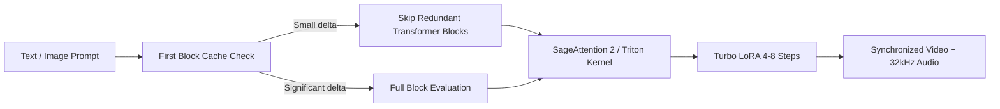

# MiniMax H3 Local Video Agent 🎬⚡
### Complete Local Runner, Comprehensive Settings Guide & Optimization Toolkit

[](LICENSE)
[](https://www.python.org/)
[](https://pytorch.org/)
[](https://nvidia.com)
[](https://github.com/deepbeepmeep/Wan2GP)

A universal, high-performance toolkit to download, configure, and run **MiniMax H3** (FL2VA & Ref2VA) locally across **all NVIDIA GPU tiers** — from 8GB/12GB consumer cards to 24GB/32GB/48GB+ enthusiast and workstation GPUs (RTX 3060/3080/4070/4080/5080/4090/5090, RTX 6000 Ada, A100, H100).

Generate everything from **quick 480p drafts in 30 seconds** up to **cinematic 1080p long-form videos with native 32kHz synchronized stereo audio and character lip-sync**.

---

## 📋 Table of Contents
- [🚀 1-Click Quickstart](#-1-click-quickstart)
- [🖥️ Universal Hardware & VRAM Matrix](#️-universal-hardware--vram-matrix)
- [🧠 Deep Dive: MiniMax H3 Models & Architectures](#-deep-dive-minimax-h3-models--architectures)
- [⚙️ In-Depth Settings & Feature Guide](#️-in-depth-settings--feature-guide)
  - [1. Quantization & Text Encoders](#1-quantization--text-encoders)
  - [2. Acceleration & Step Skipping (Turbo LoRA, First Block Cache, SageAttn)](#2-acceleration--step-skipping)
  - [3. Generation Phases & Latent Upscaling (1-Phase, 2-Phase, Tiling)](#3-generation-phases--latent-upscaling)
  - [4. Longer Videos & Sliding Windows](#4-longer-videos--sliding-windows)
  - [5. Audio Conditioning & Lip-Sync Dialogue Syntax](#5-audio-conditioning--lip-sync-dialogue-syntax)
- [📦 Model Files & Download Options](#-model-files--download-options)
- [🛠️ Troubleshooting & Memory Optimization](#️-troubleshooting--memory-optimization)
- [🙏 Credits](#-credits)

---

## 🚀 1-Click Quickstart

### Windows
1. **Clone the repository:**
   ```cmd
   git clone https://github.com/YOUR_USERNAME/minimax-h3-local-runner.git
   cd minimax-h3-local-runner
   ```
2. **Run Installer:** Double-click **`setup_windows.bat`** *(sets up Python 3.11, PyTorch CUDA, Triton, and SageAttention 2)*.
3. **Download Models:** Double-click **`download_models.bat`** and pick your desired hardware tier.
4. **Launch Web UI:** Double-click **`run_windows.bat`** and open `http://127.0.0.1:7860`.

### Linux / WSL
```bash
git clone https://github.com/YOUR_USERNAME/minimax-h3-local-runner.git
cd minimax-h3-local-runner
chmod +x *.sh

./setup_linux.sh
./download_models.sh
./run_linux.sh
```

---

## 🖥️ Universal Hardware & VRAM Matrix

MiniMax H3 is scalable. Find your GPU tier below to see the optimal model variant, resolution, and expected performance:

| GPU Tier | Typical GPUs | VRAM | Recommended Model | Max Native Res | Recommended Workflow | Generation Time |
|---|---|---|---|---|---|---|
| **Entry / Budget** | RTX 3060 (12G), 4060 Ti (16G), RTX 2080 Ti (11G) | **8 – 12 GB** | **FL2VA Pruned 20B (INT8)** + GGUF Q4 Text Enc + FP8 VAE | **480p – 720p** | Turbo LoRA (4–6 steps) + First Block Cache + Two-Phase Tiling | ~1 – 3 mins |
| **Mid / High Consumer** | RTX 3080, 4070, 4070 Ti, 4080, **RTX 5080** | **12 – 16 GB** | **FL2VA Pruned 20B (INT8)** + Quanto INT8 Text Enc | **720p (Native)** / **1080p (2-Phase)** | Turbo LoRA (6–8 steps) + First Block Cache (0.08) + Latent Upscaler | ~2 – 4 mins |
| **Top Enthusiast** | RTX 3090, 4090, **RTX 5090** | **24 – 32 GB** | **FL2VA 33B (INT8 or BF16)** / Pruned 20B | **1080p (Native)** | One-Phase Native 1080p, 8–12 steps Turbo or 20 steps standard | ~1.5 – 3 mins |
| **Workstation / Enterprise** | RTX 6000 Ada, A100 (80G), H100, B200 | **48 – 80 GB+** | **FL2VA 33B Full BF16** + BF16 Text Encoder | **1080p / 4K** | Full precision unpruned, multi-clip batch generation, 20+ steps standard | ~30s – 2 mins |

---

## 🧠 Deep Dive: MiniMax H3 Models & Architectures

When launching MiniMax H3, you have choices between several core model architectures:

### 1. FL2VA (First/Last Frame to Video & Audio)
* **What it does**: Generates synchronized video and stereo audio from **pure text**, a **start image**, an **end image**, or **both start and end images**.
* **Pruned 20B vs Full 33B**:
  * **Pruned 20B (`minimax_h3_fl2va_pruned`)**: Pruned rank-8 architecture that maintains ~95% of visual quality while reducing VRAM footprint by 40% and running significantly faster. **Best for 8GB–16GB VRAM.**
  * **Full 33B (`minimax_h3_fl2va`)**: The complete unpruned model. Delivers the absolute highest texture fidelity, intricate background physics, and fine facial micro-expressions. **Best for 24GB+ VRAM.**

### 2. Ref2VA (Reference to Video & Audio)
* **What it does**: Takes multimodal reference materials (up to **9 reference images**, **2 reference video clips**, and **2 audio clips**) to maintain character consistency, scene identity, and custom voices across shots without fixing the starting frame.
* **When to use**: Use Ref2VA for storytelling, recurring characters across multiple scenes, or styling a video after an existing art style.

### 3. PDD (Parallel Denoising Diffusion) Models
* **What it does**: Each PDD model step merges 4 learned denoising-interval outputs simultaneously, covering 32 intervals in **only 8 evaluations**.
* **When to use**: Choose `FL2VA Pruned PDD` or `Ref2VA PDD` if you want fixed 8-step high-speed generation with the Euler scheduler.

---

## ⚙️ In-Depth Settings & Feature Guide

Understanding Wan2GP's parameters lets you customize quality, speed, and memory usage for any production:

### 1. Quantization & Text Encoders

| Text Encoder Option | VRAM Impact | System RAM | Description |
|---|---|---|---|
| **Quanto INT8 (`Qwen3-VL...quanto_bf16_int8`)** | **Lowest (~6 GB)** | ~18 GB | **Recommended for most GPUs.** Excellent prompt comprehension with minimal memory overhead. |
| **GGUF Q4_K_M (`qwen3vl...Q4_K_M.gguf`)** | Low (~7 GB) | ~14 GB | Best for systems with limited System RAM (16GB–24GB RAM). |
| **Full BF16 (`Qwen3-VL...bf16`)** | High (~16 GB) | ~34 GB | Full precision text embedding; recommended for 24GB–48GB+ GPUs. |

---

### 2. Acceleration & Step Skipping



* **LightX2V Turbo LoRA**:
  * **Standard generation**: Requires 20–30 sampling steps (~15–35 minutes on consumer GPUs).
  * **With Turbo LoRA**: Requires only **4 to 8 steps** (~1–4 minutes total).
  * *Multiplier Recommendation*: Set to `0.5` – `0.6` for a balanced blend of prompt fidelity and motion stability. Set to `0.8` – `1.0` for faster convergence.
* **First Block Cache (TeaCache-style acceleration)**:
  * Analyzes the first transformer block output. If changes from the previous step are below a threshold, skips redundant deeper block evaluations.
  * `0.06 (Low)`: Maximum visual detail retention.
  * `0.08 (Balanced)`: **Recommended default** (~25% speedup, imperceptible difference).
  * `0.12 (High)`: Maximum speed for draft previews.
* **Attention Kernels**:
  * **SageAttention 2.2.0**: ~2x faster attention for RTX 30/40/50 series.
  * **Sol-Attn (Sparse Attention)**: 10–30% extra speedup on Blackwell (RTX 50-series) and Ada Lovelace (RTX 40-series) when using Triton 3.6+.

---

### 3. Generation Phases & Latent Upscaling

Under *Advanced Mode -> General -> Phases*:

1. **One Phase (Direct)**:
   - Evaluates all steps directly at target resolution (e.g. 720p or 1080p).
   - *Pros*: Best whole-frame coherence and seamless global physics.
   - *Cons*: Higher peak VRAM and computation time.
2. **Two Phases (Latent Upscaling)**:
   - Generates base motion at half resolution (e.g. 360p), upscales the 3D latent with `minimax_h3_latent_upscaler_3d_bf16`, and executes a 3-step high-res refinement.
   - *Pros*: Produces sharp 720p/1080p output significantly faster.
3. **Two Phases with Tiling (Low VRAM 1080p/4K)**:
   - Splits the second phase into 4 overlapping spatial tiles.
   - *Pros*: Allows **1080p video generation on 12GB–16GB VRAM cards** without Out-of-Memory crashes!
   - *Adjustment*: Adjust *Phase 2 Noise Level Start* (default 0.05) to eliminate tile seams.

---

### 4. Longer Videos & Sliding Windows

MiniMax H3 generates 4 to 15 seconds per window natively at 24 FPS. To create clips of **30s, 60s, or full minutes**:

* **Sliding Window Continuation**:
  - Automatically transfers the previous segment's end motion and audio harmonics into the next window.
  - Set overlap frames to H3 standard values: `18`, `35`, or `52` frames for smooth transitions.
* **Storyboarding & Hard Cuts**:
  - Use `[/new_shot]` in your prompt to direct scene changes and camera switches between sliding windows without blending artifacts.
* **Keyframe Injections**:
  - Insert reference images at designated frame timestamps (e.g. Frame 1, Frame 72, or `L` for end frame) to anchor key visual events.

---

### 5. Audio Conditioning & Lip-Sync Dialogue Syntax

MiniMax H3 features native text-to-audio-video modeling. Use structured multimodal prompts to control speech, Foley sound effects, and musical score:

```text
integrated_multimodal_description: [Shot 1] A cinematic wide shot of a cyberpunk detective walking through a neon-lit alley in heavy rain. He stops beneath a flickering billboard, turns to the camera, and says clearly (S1) <d>[English] The data was corrupted before we even arrived.</d> While speaking, he lights a cigarette and exhales smoke into the rain.
overall_soundscape: Heavy rain falling on wet asphalt, puddle splashes, distant siren wails, a match striking, cigarette sizzle, and crystal-clear voice audio with accurate lip-synchronization.
non_diegetic_music: A dark synthwave bassline humming underneath with melancholic piano keys.
```

- `(S1) <d>[Language] Dialogue text</d>`: Flags spoken dialogue for Speaker 1 with lip-sync.
- `overall_soundscape: ...`: Diegetic Foley sounds, ambient noise, and environmental acoustics.
- `non_diegetic_music: ...`: Soundtrack, musical genres, instruments, and background moods.

---

## 📦 Model Files & Download Options

Launch the interactive downloader anytime:
```cmd
python download_models.py
```

### Pre-built Presets:
* **`1. recommended` (~39.5 GB)**: Pruned INT8 + Quanto INT8 Text Encoder + VAEs + Latent Upscaler + Turbo LoRA *(Ideal for 12GB–16GB GPUs like RTX 5080/4080/4070)*.
* **`2. recommended_gguf` (~38.0 GB)**: Pruned INT8 + GGUF Q4 Text Encoder + FP8 VAE + Turbo LoRA *(Ideal for 8GB–12GB VRAM / low RAM systems)*.
* **`3. full` (~85.0 GB)**: Full 33B BF16 checkpoint + Quanto INT8 + VAEs + Turbo LoRA *(For 24GB+ GPUs like RTX 4090/3090/5090)*.
* **`4. turbo_only` (~0.4 GB)**: Just the Latent 3D Upscaler and LightX2V Turbo LoRAs.

---

## 🛠️ Troubleshooting & Memory Optimization

1. **`CUDA out of memory` (OOM)**:
   - Switch from `One Phase` to `Two Phases with Tiling` under *Advanced Mode*.
   - Use the **Pruned INT8 ConvRot** model rather than unpruned BF16.
   - Set `PYTORCH_CUDA_ALLOC_CONF=expandable_segments:True` (automatically set by `run_windows.bat` and `run_linux.sh`).
2. **Drive Space Management**:
   - The launcher scripts automatically route `HF_HOME`, `TORCH_HOME`, and `TMPDIR` to the project folder, preventing your OS drive (`C:`) from filling up.
3. **Audio / Video De-sync**:
   - Ensure the generation frame rate is set to `24 FPS` (the native training frame rate for MiniMax H3).

---

## 🙏 Credits

- **[MiniMax AI](https://huggingface.co/MiniMaxAI)**: MiniMax H3 foundation model.
- **[DeepBeepMeep](https://github.com/deepbeepmeep/Wan2GP)**: Wan2GP engine, INT8 ConvRot quantization, and Web UI.
- **[LightX2V](https://github.com/LightX2V)**: Turbo LoRA acceleration models.
- **[Qwen Team](https://github.com/QwenLM/Qwen)**: Qwen3-VL multimodal vision-language models.

---

## 📄 License
This project is open-source under the [MIT License](LICENSE). Checkpoint files follow the upstream MiniMax and Wan2GP model license agreements.
